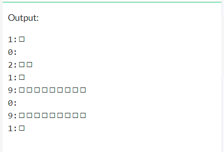

# assignment 03
Terdapat kode Python berikut ini yang akan digunakan.
```python
import html
char1 = html.unescape('&#x25FB;')
char2 = html.unescape('&#x25FC;')

NIM = '10298345'
for x in NIM:
  n = int(x, 10)
  s = ''
  for i in range(n):
    s += char
  print(n, ':', s, sep='')
```


## question 1
Ganti nilai variabel NIM dengan data Anda, jalankan kode yang diberikan, dan tampilkan hasilnya.

### anwser 1
Hasil kode di atas adalah


Proof at OneCompiler [3xrcrh75b](https://onecompiler.com/python/3xrcrh75b)

## question 2
Ganti nilai variabel NIM dengan data Anda, modifikasi kode yang diberikan di atas dengan `s += char1`, jalankan dan tampilkan hasilnya.

### anwser 2
Hasil modifikasi kode di atas adalah
```
```



Proof at OneCompiler [3xrcsqdys](https://onecompiler.com/python/3xrcsqdys)

## question 3
Ganti nilai variabel NIM dengan data Anda, modifikasi kode yang diberikan di atas dengan `s += char2`, jalankan dan tampilkan hasilnya.

### anwser 3
Hasil modifikasi kode di atas adalah
```
```


Proof at OneCompiler [3xrct4f8z](https://onecompiler.com/python/3xrct4f8z)

## question 4
Jelaskan dengan singkat hal yang dihasillkan oleh kode yang diberikan.

### answer 4
Kode di atas berfungsi untuk
+ kode pertama ``` import html ``` berfungsi untuk memangil  library html python sehingga command seperti ```
char1 = html.unescape('&#x25FB;') & char2 = html.unescape('&#x25FC;') ``` dapat digunakan. kedua kode tersebut mengubah variabel char1 dan char 2 yang berisi karakter ascii (&#x25FB & &#x25FC) menjadi ditampilkan sebagai karakter khusus
+ selanjutnya kode ``` NIM=10219091``` membuat variabel string yang berisi nim 
+ 
