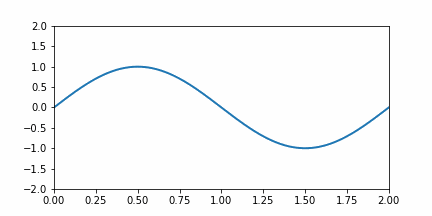

# assignment 04
Terdapat kode Python berikut

```python
"""
Matplotlib Animation Example

author: Jake Vanderplas
email: vanderplas@astro.washington.edu
website: http://jakevdp.github.com
license: BSD
Please feel free to use and modify this, but keep the above information. Thanks!
"""

import numpy as np
from matplotlib import pyplot as plt
from matplotlib import animation

# First set up the figure, the axis, and the plot element we want to animate
fig = plt.figure()
ax = plt.axes(xlim=(0, 2), ylim=(-2, 2))
line, = ax.plot([], [], lw=2)

# initialization function: plot the background of each frame
def init():
    line.set_data([], [])
    return line,

# animation function.  This is called sequentially
def animate(i):
    x = np.linspace(0, 2, 1000)
		
		# ---- equation of y ----
		
		# -----------------------
		
    line.set_data(x, y)
    return line,

# call the animator.  blit=True means only re-draw the parts that have changed.
anim = animation.FuncAnimation(fig, animate, init_func=init,
                               frames=200, interval=20, blit=True)

# save the animation as an mp4.  This requires ffmpeg or mencoder to be
# installed.  The extra_args ensure that the x264 codec is used, so that
# the video can be embedded in html5.  You may need to adjust this for
# your system: for more information, see
# http://matplotlib.sourceforge.net/api/animation_api.html
anim.save('basic_animation.mp4', fps=30, extra_args=['-vcodec', 'libx264'])

#plt.show()


# lines above this line is the original code from Jake Vanderplas
# url https://jakevdp.github.io/downloads/code/basic_animation.py

# modification from Sparisoma Viridi 2022-03-29
option = 0

if option == 0:
	writergif = animation.PillowWriter(fps=30)
	anim.save('basic_animation.gif', writer=writergif)
# anim.save('basic_animation.mp4', fps=30, extra_args=['-vcodec', 'libx264'])
else:
	plt.show()


```
yang dapat diperoleh di <https://jakevdp.github.io/downloads/code/basic_animation.py>.

## question 1
Baca penjelasan mengenai kode di atas pada <https://dudung.github.io/bugx/0026/> atau pada pertemuan kuliah terkait.

### answer 1
Apakah penjelasan kode dia atas sudah dibaca atau hadir pada kuliah?
```
ya. line 15 hingga 17 merupakan perintah untuk memanggil fungsi dari library. kemudian line 23-25 adalah kode untuk mempersiapkan figure/ grafik tempat dimana fungsi akan di animasikan. kemudian di buat 2 fungsi yang menghasilkan data yang akan dianimasikan dan terakhir adalah perintah untuk menyimpan animasi sebagai gif.  
```

## question 2
Modifikasi program yang diberikan sehingga dapat menggambarkan gelombang yang merambat ke kanan dengan panjang gelombang &lambda; = 2 m dan periode T = 2 s. Perolehlah pula berkas gif hasilnya.

### answer 2
Potongan kode yang perlu disisipkan adalah
```
di karenakan fungsi gelombang pada umumnya memenuhi persamaan berikut !.[].(persamaan gelombang umum.PNG) maka kode yang perlu dimasukkan adalah !.[].(fungsi q 2.PNG) selain itu juga perlu menghapus tanda # didepan writegif serta anim.save(.gif)

```
dan hasil berkas gifnya adalah \



## question 3
Modifikasi program yang diberikan sehingga dapat menggambarkan gelombang yang merambat ke kiri dengan panjang gelombang &lambda; = 2 m dan periode T = 2 s. Perolehlah pula berkas gif hasilnya.

### answer 3
Potongan kode yang perlu disisipkan adalah
```
Hal yang sama dilakukan untuk pertanyaan 3 namun persamaan dari fungsi gelombang sedikit berubah karena arah nya menuju x negatif sehingga perlu dimasukkan kode berikut 
```
dan hasil berkas gifnya adalah \


## question 4
Modifikasi program yang diberikan sehingga dapat menggambarkan gelombang stasioner yang tidak merambat dengan panjang gelombang &lambda; = 2 m dan periode T = 2 s. Perolehlah pula berkas gif hasilnya.

### answer 4
Potongan kode yang perlu disisipkan adalah
```
persamaan umum dari gelombang diam adalah  dan dengan mengubah nilai k dan omega perlu dimasukkan kode berikut 
```
dan hasil berkas gifnya adalah \

